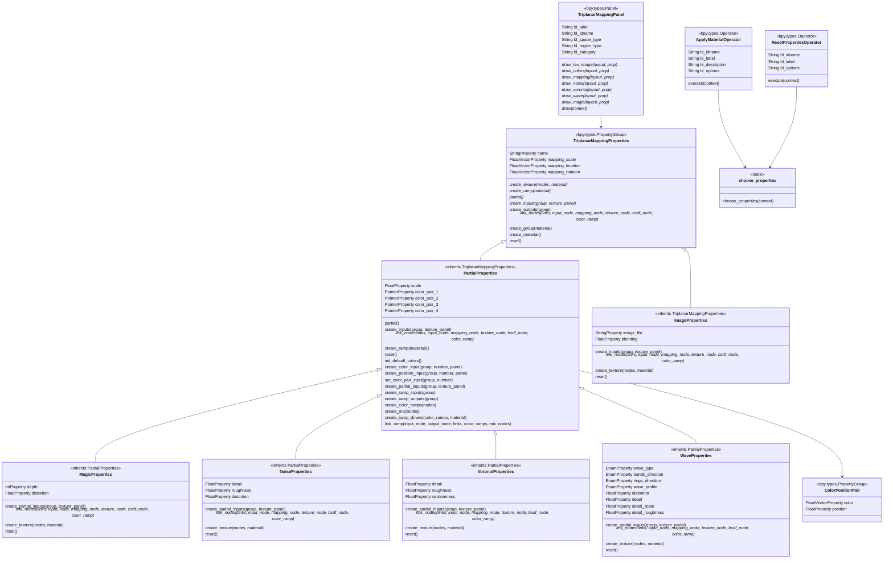

# **Blender Triplanar Texture Mapping Add-On**

---
**Author:** Sofiia Prykhach

 **Version:** 1.0.0 
 
 **Blender Compatibility:** 4.3.0 and later 
 
 **Category:** Material
 
---
## **Overview**

The Triplanar Texture Mapping Add-On enables Blender users to quickly create and apply procedural triplanar materials to objects. 
It simplifies texturing for complex objects, eliminating the need for precise UV mapping.
The aim is to streamline the creation and manipulation of textures with minimal effort, offering an intuitive interface for users.

## **Features**
-  Apply textures without UV maps. 	
- Customizable triplnar mapping, that supports different types of procedural texture generations:
	- Image textures
	- Noise textures
	- Voronoi textures
	- Wave textures
	- Magic textures
- Each texture type comes with configurable properties to adjust the appearance and behavior of the textures.
- Reset settings to defaults with one click.
- Fully integrated with Blender's material system.

---

## **Getting Started**

### **Installation**
1. Download the latest version of the add-on from the [Releases](#) section.
2. Open Blender and go to `Edit > Preferences > Add-ons`.
3. Click `Install...` and select the downloaded `.zip` file.
4. Enable the add-on by checking the box next to its name.

### **Usage**
1. Select the objects in your scene that you want to apply materials to.
2. Open the Shader Editor workspace.
3. In the `Triplanar Mapping Panel` panel  in the Shader Editor
4. Find the "Type" Dropdown Menu
In the panel, there will be a dropdown menu labeled Type. This is where you can select the kind of texture you want to apply to your object.
5. Select a Texture Type
6. The Type dropdown menu offers several texture options:
	  * **None**: No texture is applied.
	  * **Image**: Allows you to use an external image file as a texture.
	  * **Noise**: Generates a procedural noise texture.
	  * Voronoi: Uses the Voronoi pattern, great for creating cellular textures.
	  * **Waves**: Applies a wave-based texture.
	  * **Magic**: Applies a magic-like texture.
5. Adjust the material settings to your preference.
6. Optionally, reset settings to defaults as needed.
7. Click the 'Apply' button to apply the material to the selected objects.
8. After applying, modify the material in the `Material Settings > Surface` if needed.
 

#### Apply Image Texture Tutorial:

####  Apply Noise Texture Tutorial:

####  Apply Voronoi Texture Tutorial:

####  Apply Wave Texture Tutorial:

####  Apply Magic Texture Tutorial:
---
# Technical Documentation 

## Core Principles 
The types of materials that can be mapped using this add-on are grouped into two main categories:

 - **Partially Generated Textures**:
Includes procedural textures such as Noise, Wave, Voronoi, and Magic textures.
- **Image Textures**:
Use external images as the texture source.

The implementation for both categories is similar at the `ShaderNodeTree` level. The main difference lies in the use of the `CustomRamp`, which provides advanced coloring options for partially generated textures. This design decision led to the use of inheritance for organizing code effectively.

### Inheritance
This project is designed with modularity in mind, enabling the easy addition of new texture types and properties without requiring significant changes to the existing codebase.

The **`TriplanarMappingProperties`** class provides the foundational structure for the material node tree. Its child classes define specific texture nodes and their inputs, create necessary drivers, and establish connections between inputs and nodes.
The **`PartialProperties`** class introduces the `ShaderNodeGroup` for the custom ramp, which is essential for all its child classes (e.g., Noise, Wave).

*`(All details about texture types, panels, and the implementation of the custom ramp are described in the subsequent Core Classes section).`*

### Properties
Properties for each mapping type (available both in the add-on panel and the material nodes) are divided into three main segments:

- **Texture Properties** :
These store parameters specific to the texture type, such as scale, detail, roughness, etc. This segment is unique to each texture type.
- **Mapping Properties**:
This segment is universal and helps users control the mapping of textures for seamless transitions across surfaces.
- **Color Properties**:
An additional group of properties that control the coloring of partially generated materials.  Contains 4 pairs of color value and their position in the Color Ramp

### Illustration
The following class diagram demonstrates the relationships and dependencies within the project:

## File Structure

**`program_files/__init__.py`**  
Initializes the add-on and registers necessary classes and operators.

**`program_files/blender_classes/`**  
Contains Python modules for the add-on's core logic and functionality:  
- **`triplanar_panel.py`**  
  Defines the user interface panel for configuring texture properties.  
- **`triplanar_operator.py`**  
  Implements two operators:  
  1. `ApplyMaterialOperator`: Generates and applies materials to selected meshes.  
  2. `ResetPropertiesOperator`: Resets texture properties to their default values.  
- **`triplanar_properties.py`**  
  Serves as the base class for texture-related properties, providing reusable methods like `create_group`.  
- **`image_properties.py`**  
  Manages properties specific to image textures.  
- **`partial_properties.py`**  
  Provides shared functionality for partial texture generation, including input/output creation and color ramp handling.  
- **`noise_properties.py`**  
  Defines properties for generating noise textures.  
- **`wave_properties.py`**  
  Manages properties for wave-based textures.  
- **`magic_properties.py`**  
  Contains properties for creating magic textures.  
- **`voronoi_properties.py`**  
  Handles properties for Voronoi texture generation.  
---

## Core Classes and Inheritance Structure

### 1. ` TriplanarMappingProperties` 

The `TriplanarProperties`is a base class designed to provide essential functionality for subclasses representing specific texture types. Generates a complete material node tree based on triplanar mapping. Ensures accurate connections between texture coordinate, mapping, texture, and shader nodes.

 #### Properties
   - **`name`**: Specifies the name of the material created by this property group.
	   -	Type: `StringProperty`
	   -	Default: `"DefaultPlanar_Material"`
   - **`mapping_scale`**: Determines the scale of the amount of scaling along the X, Y, and Z axes.
	   - Type: `FloatVectorProperty`
	   -  Default: `(0.4, 0.4, 0.4)`
	   - Range: -1000 to 1000
	   - UI Subtype: `XYZ`
   - **`mapping_location`**: Specifies the amount of translation along each axis.
	   -    Type: `FloatVectorProperty`
	   -   Default: `(0.0, 0.0, 0.0)`
	   -   UI Subtype: `TRANSLATION`
   - **`mapping_rotation`**: A `FloatVectorProperty` - amount of rotation along each axis. XYZ order.
	   -   Type: `FloatVectorProperty`
	   -   Default: `(0.0, 0.0, 0.0)`
	   -   UI Subtype: `EULER`

#### Methods
- **`create_texture(self, nodes, material)`**: 
Provides a default implementation for creating texture nodes. This method is intended to be overridden by subclasses for specific texture types.

**Returns:** A new texture node, default type is`ShaderNodeTexImage`.

- **`create_inputs(self, group, texture_panel)`**: Dynamically creates input sockets for subclass properties 
- **` partial(self)`**: Indicates whether the material will contain partially generated texture. Subclasses can override this method. 

**Returns**: `False` (default behavior).

- `create_outputs(self, group)`: Adds an output socket to the node group for the shader.
   
- `link_nodes(self, links, input_node, mapping_node, texture_node, bsdf_node, color_ramp)` : Connects input properties, color ramp and nodes, enabling seamless integration.

- **`create_group(self, material)`**: Generates a node group inside a material that provides triplanar mapping functionality. This method creates and links nodes, inputs and outputs of the group. The `texture_node`, created by the `create_texture(self, nodes, material)` method, is unique for each subclass of the property group. Additionally, for partial generation, supports optional integration of custom color ramps via `partial` and `create_ramp` methods

	**Steps**:
    1.  Adds input and output sockets.
    2.  Creates nodes such as Texture Coordinate, Mapping, Principled BSDF, and optional Custom Ramp.
    3.  Links nodes to define the material workflow. 

	**Returns**: The created node group.

- **`create_material(self)`**: Generates a new material using the node group created by `create_group()`.

	**Steps**:
    1.  Creates a new material.
    2.   Adds a node group to the material's node tree.
    3.   Connects the node group to the material output.

	**Returns**: The created material.

- **`reset(self)`**: Resets all properties to their default values. This method is intended to be overridden by subclasses for specific texture types.

---

### 2. `ImageProperties` 

The `ImageProperties` class is a specialized subclass of `TriplanarMappingProperties` for handling image-based textures. This class manages the loading, customization, and application of external image files as textures.

#### Properties:
- **`image_file`**: A `StringProperty` representing the file path to the image texture.
- **`blending`**: A `FloatProperty` for controlling the blend intensity between the triplanar projections.

#### Methods:
- **`create_texture(nodes, material)`**:
  Generates the `ShaderNodeTexImage` and configures its parameters using the `texture` and `blending` properties. Creats a driver to manipulate 'Blend' parameter;
  
---
### 3. PartialProperties

`PartialProperties` is a subclass of `TriplanarMappingProperties` designed for generating custom triplanar texture properties with support for partial texture creation. It introduces additional features, including a custom color ramp with up to 4 configurable color-position pairs that is configurable outside the node group

#### Custom Ramp Node Group:

 #### Properties
- `scale`: Controls the scale of the texture.
	- Type: `FloatProperty`
	- Range: -1000 to 1000
	- Default: 30

- `color_pair_1`, `color_pair_2`, `color_pair_3`, `color_pair_4`: Defines color-position pairs for the custom color ramp.
	- Type: `PointerProperty` (to `ColorPositionPair`)

 #### Methods
 - `partial(self)` Indicates that this material uses partial texture creation.

**Returns**: `True`

- `create_ramp(self, material)`: Creates a custom color ramp node group for partial materials.

**Returns**: A new node group of type `ShaderNodeTree`.
**Steps**:
   1.  Adds input and output sockets.
   2.  Creates 3 `ShaderNodeValToRGB` and 3 `ShaderNodeMix`
   3.  Links nodes to define the custom color ramp workflow.

       
- Related to creation of custom color ramp:
	- `init_default_colors(self)`: Initializes the default colors and positions for the color pairs.
	- `create_color_input(self, group, number, panel)`:
	Creates a f"Color {number}" input of type 'NodeSocketColor' inside the group. 
	- `create_position_input(self, group, number, panel)`:
 	Creates a "Color position {number}" input of type 'NodeSocketFloat' inside the  group
	- `set_color_pair_input (self, group, number)`:
	Set the pair of inputs ("Color {number}", "Color position {number}") using f"color_pair_{number}" property
	- `create_partial_inputs(self, group, texture_panel)`: Function to create inputs of subclasses between scale input and color inputs. This method is intended to be overridden by subclasses for specific texture types.
	- `create_ramp_inputs(self, group)`: creates inputs for the color ramp group
	- `create_ramp_outputs(self, group)`: creates outputs for the color ramp group
	- `create_color_ramps(self, nodes)`: creates 3 `ShaderNodeValToRGB`

   	**Returns:** array of `ShaderNodeValToRGB`
	-  `create_mix (self, nodes)`: creates 3 `ShaderNodeMix`

    	**Returns:** array of `ShaderNodeMix`
	- `create_ramp_drivers(self, color_ramps, material)`: creates a driver for 4 different color stops
	- `link_ramp(self, input_node, output_node, links, color_ramps, mix_nodes)`: Connects  nodes inside the ramp

---

