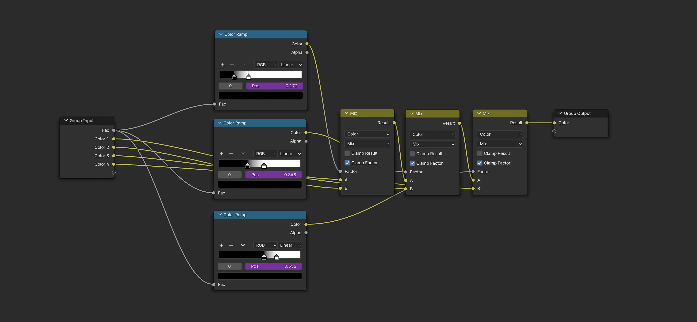

# **Blender Triplanar Texture Mapping Add-On**

---
**Author:** Sofiia Prykhach

 **Version:** 1.0.0 **
 
 Blender Compatibility:** 4.3.0 and later 
 
 **Category:** Material

---
## **Overview**

The Triplanar Texture Mapping Add-On enables Blender users to quickly create and apply procedural triplanar materials to objects. 
It simplifies texturing for complex objects, eliminating the need for precise UV mapping.
The aim is to streamline the creation and manipulation of textures with minimal effort, offering an intuitive interface for users.

## **Features**
-  Apply textures without UV maps. 	
- Customizable triplnar mapping, that supports different types of procedural texture generations:
	- Image textures
	- Noise textures
	- Voronoi textures
	- Wave textures
	- Magic textures
- Each texture type comes with configurable properties to adjust the appearance and behavior of the textures.
- Reset settings to defaults with one click.
- Fully integrated with Blender's material system.

---

---
## **Getting Started**

### **Installation**
1. Download the latest version of the add-on from the [Releases](#) section.
2. Open Blender and go to `Edit > Preferences > Add-ons`.
3. Click `Install...` and select the downloaded `.zip` file.
4. Enable the add-on by checking the box next to its name.

### **Usage**
1. Select the objects in your scene that you want to apply materials to.
2. Open the Shader Editor workspace.
3. In the `Triplanar Mapping Panel` panel  in the Shader Editor
4. Find the "Type" Dropdown Menu
In the panel, there will be a dropdown menu labeled Type. This is where you can select the kind of texture you want to apply to your object.
5. Select a Texture Type
6. The Type dropdown menu offers several texture options:
	  * **None**: No texture is applied.
	  * **Image**: Allows you to use an external image file as a texture.
	  * **Noise**: Generates a procedural noise texture.
	  * Voronoi: Uses the Voronoi pattern, great for creating cellular textures.
	  * **Waves**: Applies a wave-based texture.
	  * **Magic**: Applies a magic-like texture.
5. Adjust the material settings to your preference.
6. Optionally, reset settings to defaults as needed.
7. Click the 'Apply' button to apply the material to the selected objects.
8. After applying, modify the material in the `Material Settings > Surface` if needed.
 

---
## Technical Documentation 
### 1. File Structure
- **`program_files/__init__.py`**:
 This file serves as the initialization script for the add-on.
 - **`program_files/blender_classes/`** : Directory contains all the Python files responsible for the main logic of the add-on
	 - **`triplanar_panel.py`**: The file contains the UI panel, that allows users to configure texture properties according to the chosen type.
	 - **`triplanar_operator.py`**:  Contains two operators:
		1. Operator `ApplyMaterialOperator` generates a material and applies it to the selected meshes. 
		2. Operator `ResetPropertiesOperator` resets a selected texture property to its default values.
	- **`triplanar_properties.py`**: Serves as the base class for all texture-related properties in the add-on. By inheriting from this  class, other property classes can easily reuse methods like `create_group` and other
	- **`image_properties.py`**: Provides properties related to image textures.
	- **`partial_properties.py`**: This is the base class that provides common functionality for partial generated texture properties. It contains logic for creating and linking  inputs, outputs and handling color ramps.
	- **`noise_properties.py`**: Contains properties for generating noise textures.
	- **`wave_properties.py`**: Provides properties for wave-based textures.
	- **`magic_properties.py`**: Contains properties for generating magic textures
	- **`voronoi_properties.py`**: Contains properties related to Voronoi textures.

---
### 2. Core Classes and Inheritance Structure
#### 2.1 TriplanarMappingProperties

The `TriplanarProperties`is a base class designed to provide essential functionality for subclasses representing specific texture types. Generates a complete material node tree based on triplanar mapping. Ensures accurate connections between texture coordinate, mapping, texture, and shader nodes.

 #### Properties
   - **`name`**: Specifies the name of the material created by this property group.
	   -	Type: `StringProperty`
	   -	Default: `"DefaultPlanar_Material"`
   - **`mapping_scale`**: Determines the scale of the amount of scaling along the X, Y, and Z axes.
	   - Type: `FloatVectorProperty`
	   -  Default: `(0.4, 0.4, 0.4)`
	   - Range: -1000 to 1000
	   - UI Subtype: `XYZ`
   - **`mapping_location`**: Specifies the amount of translation along each axis.
	   -    Type: `FloatVectorProperty`
	   -   Default: `(0.0, 0.0, 0.0)`
	   -   UI Subtype: `TRANSLATION`
   - **`mapping_rotation`**: A `FloatVectorProperty` - amount of rotation along each axis. XYZ order.
	   -   Type: `FloatVectorProperty`
	   -   Default: `(0.0, 0.0, 0.0)`
	   -   UI Subtype: `EULER`

#### Methods
1. **`create_texture(self, nodes, material)`**: 
Provides a default implementation for creating texture nodes. This method is intended to be overridden by subclasses for specific texture types.
**Returns:** A new texture node, default type is`ShaderNodeTexImage`.

2. **`create_inputs(self, group, texture_panel)`**: Dynamically creates input sockets for subclass properties 
**Returns**: A new node group of type `ShaderNodeTree`.
3. **` partial(self)`**: Indicates whether the material will contain partially generated texture. Subclasses can override this method. 
**Returns**: `False` (default behavior).

4.  `create_inputs(self, group, texture_panel)`Adds input sockets to the node group, optionally add them to texture panel

5. `create_outputs(self, group)`: Adds an output socket to the node group for the shader.
   
6.  **`link_inputs(self, links, input_node, mapping_node, texture_node, color_ramp)`**: Connects input properties to the mapping, texture, and ramp nodes, enabling seamless integration.

7. `link_outputs(self, links, output_node, bsdf_node)`: Links the shader node to the output node.

8. `link_partial(self, links, texture_node, custom_ramp, bsdf_node)`: Placeholder for linking nodes in partial texture setups. Meant to be overridden by subclasses.

9. **`create_group(self, material)`**: Generates a node group inside a material that provides triplanar mapping functionality. This method creates and links nodes, inputs and outputs of the group. The `texture_node`, created by the `create_texture(self, nodes, material)` method, is unique for each subclass of the property group. Additionally, for partial generation, supports optional integration of custom color ramps via `partial` and `create_ramp` methods

	**Steps**:
    1.  Adds input and output sockets.
    2.  Creates nodes such as Texture Coordinate, Mapping, Principled BSDF, and optional Custom Ramp.
    3.  Links nodes to define the material workflow. 

	**Returns**: The created node group.

10. **`create_material(self)`**: Generates a new material using the node group created by `create_group()`.

	**Steps**:
    1.  Creates a new material.
    2.   Adds a node group to the material's node tree.
    3.   Connects the node group to the material output.

	**Returns**: The created material.

12. **`reset(self)`**: Resets all properties to their default values. This method is intended to be overridden by subclasses for specific texture types.

#### 2.2 PartialProperties

`PartialProperties` is a subclass of `TriplanarMappingProperties` designed for generating custom triplanar texture properties with support for partial texture creation. It introduces additional features, including a custom color ramp with up to 4 configurable color-position pairs that is configurable outside the node group

---

 #### Properties
- `scale`: Controls the scale of the texture.
	- Type: `FloatProperty`
	- Range: -1000 to 1000
	- Default: 30

- `color_pair_1`, `color_pair_2`, `color_pair_3`, `color_pair_4`: Defines color-position pairs for the custom color ramp.
	- Type: `PointerProperty` (to `ColorPositionPair`)

---

 #### Methods

1. `init_default_colors(self)`: Initializes the default colors and positions for the color pairs.

2. `partial(self)` Indicates that this material uses partial texture creation.
**Returns**: `True`
3. `create_color_input(self, group, number, panel)`:
Creates a f"Color {number}" input of type 'NodeSocketColor' inside the group. 
4. `create_position_input(self, group, number, panel)`:
 Creates a "Color position {number}" input of type 'NodeSocketFloat' inside the  group
5. `set_color_pair_input (self, group, number)`:
Set the pair of inputs ("Color {number}", "Color position {number}") using f"color_pair_{number}" property
6. `create_partial_inputs(self, group, texture_panel)`: Function to create inputs of subclasses between scale input and color inputs. This method is intended to be overridden by subclasses for specific texture types.

7. `create_ramp_inputs(self, group)`: creates inputs for the color ramp group
8. `create_ramp_outputs(self, group)`: creates outputs for the color ramp group
9. `create_color_ramps(self, nodes)`: creates 3 `ShaderNodeValToRGB`
**Returns:** array of `ShaderNodeValToRGB`
10.  `create_mix (self, nodes)`: creates 3 `ShaderNodeMix`
11. **Returns:** array of `ShaderNodeMix`
12. `create_ramp_drivers(self, color_ramps, material)`: creates a driver for 4 different color stops
13. `link_ramp(self, input_node, output_node, links, color_ramps, mix_nodes)`: Connects  nodes inside the ramp

14.  `link_partial(self, links, texture_node, custom_ramp, bsdf_node)`: Connects the texture node's color output to the custom ramp's input.Links the custom ramp's output to the BSDF node's Base Color input.

16. `create_ramp(self, material)`: Creates a custom color ramp node group for partial materials.
**Returns**: A new node group of type `ShaderNodeTree`.
**Steps**:
   1.  Adds input and output sockets.
   2.  Creates 3 `ShaderNodeValToRGB` and 3 `ShaderNodeMix`
   3.  Links nodes to define the custom color ramp workflow.

       

