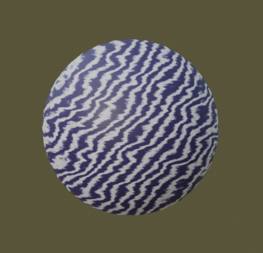

# **Blender Triplanar Texture Mapping Add-On**

---
**Author:** Sofiia Prykhach

 **Version:** 1.0.0 
 
 **Blender Compatibility:** 4.3.0 and later 
 
 **Category:** Material
 
---
## **Overview**

The Triplanar Texture Mapping Add-On enables Blender users to quickly create materials with usage of triplanar mapping of different kind of textures. 
It simplifies texturing for complex objects, eliminating the need for precise UV mapping.
The aim is to streamline the creation and manipulation of textures with minimal effort, offering an intuitive interface for users.

## **Features**
-  Apply textures without UV maps. 	
- Customizable triplnar mapping, that supports different types of procedural texture generations:
	- Image textures
	- Noise textures
	- Voronoi textures
	- Wave textures
	- Magic textures
- Each texture type comes with configurable properties to adjust the appearance and behavior of the textures.
- Reset settings to defaults with one click.
- Fully integrated with Blender's material system.

 
---

## **Getting Started**

### **Installation**
1. Download the latest version of the add-on from the [Releases](#) section.
2. Open Blender and go to `Edit > Preferences > Add-ons`.
3. Click `Install...` and select the downloaded `.zip` file.
4. Enable the add-on by checking the box next to its name.

### **Usage**
1. Select the objects in your scene that you want to apply materials to.
2. Open the Shader Editor workspace.
3. In the `Triplanar Mapping Panel` panel  in the Shader Editor
4. Find the "Type" Dropdown Menu
In the panel, there will be a dropdown menu labeled Type. This is where you can select the kind of texture you want to apply to your object.
5. Select a Texture Type
6. The Type dropdown menu offers several texture options:
	  * **Image**: Allows you to use an external image file as a texture.
	  * **Noise**: Generates a procedural noise texture.
	  * Voronoi: Uses the Voronoi pattern, great for creating cellular textures.
	  * **Waves**: Applies a wave-based texture.
	  * **Magic**: Applies a magic-like texture.
5. Adjust the material settings to your preference or reset settings to defaults.
7. Click the 'Apply' button to apply the material to the selected objects.
8. After applying, modify the material in the `Material Settings > Surface` if needed.

___

## Tutorials 
#### Apply Image Texture Tutorial:


####  Apply Noise Texture Tutorial:

####  Apply Voronoi Texture Tutorial:


####  Apply Wave Texture Tutorial:

####  Apply Magic Texture Tutorial:
---
# Technical Documentation 

Triplanar mapping applies textures by blending three planar projections along the X, Y, and Z axes. The blending function prevents visible seams and ensures a smooth transition between projections. The implementation follows these steps:

1. Compute world-space coordinates.

2. Project the texture along each primary axis.

3. Blend the projections based on surface normal influence.

4. Output the final shader network for rendering.


###  Texture Types
The types of materials that can be mapped using this add-on are grouped into two main categories:

 - **Partially Generated Textures**:
Includes procedural textures such as Noise, Wave, Voronoi, and Magic textures.
- **Image Texture**:
Use external images as the texture source.

The implementation for both categories is similar at the `ShaderNodeTree` level. The main difference lies in the use of the `CustomRamp`, which provides advanced coloring options for partially generated textures. This design decision led to the use of inheritance for organizing code effectively.

The `texture_type` EnumProperty is a key feature, enabling the user to select different types of textures and dynamically load the corresponding properties and user interface panels.
The `texture_type` EnumProperty determines:
1. **Property Set:** Which property set is loaded and displayed in the UI, enabling the user to configure texture-specific attributes.
2. **Panel Drawing Logic:** Which UI panel section is drawn in the `TriplanarMappingPanel` to represent the selected texture type's properties.
3. **Behavior of Operators:** What action is performed when operators like `Apply Planar` or `Clear All` are triggered, ensuring the behavior aligns with the selected texture type.

| **Texture Type (`texture_type`)** | **Description**                                                                 | **Node Type, created by `create_texture(self, nodes, material)`**              | **Example of Resulting Material**                                      |
|-------------------|---------------------------------------------------------------------------------|-----------------------------|------------------------------------------------------------------------|
| **Image Texture** (`TEX_IMAGE`) | Utilizes an image as the base texture. | `ShaderNodeTexImage`        |   |
| **Noise Texture** (`NOISE`)     | Generates procedural noise, useful for simulating randomness, roughness, or natural patterns.    | `ShaderNodeTexNoise`        |  |    
| **Voronoi Texture** (`VORONOI`) | Creates cellular patterns often used for organic or crystalline structures.                       | `ShaderNodeTexVoronoi`      |  |          
| **Wave Texture** (`WAVES`)      | Produces sine wave patterns in bands or concentric rings for artistic or stylized surfaces.      | `ShaderNodeTexWave`         |  |                   
| **Magic Texture** (`MAGIC`)     | Generates chaotic, psychedelic patterns with controllable depth for unique effects.              | `ShaderNodeTexMagic`        |  |


#### **Definition**
```python
bpy.types.Scene.texture_type = bpy.props.EnumProperty(
    name="Type",
    description="Choose a type",
    items=[
        ('NONE', "-", "No type is selected"),
        ('TEX_IMAGE', "Image", "Properties for Texture Image"),
        ('NOISE', "Noise", "Properties for Noise"),
        ('VORONOI', "Voronoi", "Properties for Voronoi Texture"),
        ('WAVES', "Waves", "Properties for Wave Texture"),
        ('MAGIC', "Magic", "Properties for Magic Texture"),
    ],
    default='NONE'
)
```

### Inheritance
This project is designed with modularity in mind, enabling the easy addition of new texture types and properties without requiring significant changes to the existing codebase.

The **`TriplanarMappingProperties`** class provides the foundational structure for the material node tree. Its child classes define specific texture nodes and their inputs, create necessary drivers, and establish connections between inputs and nodes.
The **`PartialProperties`** class introduces the `ShaderNodeGroup` for the custom ramp, which is essential for all its child classes (e.g., Noise, Wave).

*`(All details about texture properties, panels, and the implementation of the custom ramp are described in the subsequent Core Classes section).`*


### Material properties
Properties for each mapping type (available both in the add-on panel and the material nodes) are divided into three main segments:

- **Texture Properties** :
These store parameters specific to the texture type, such as scale, detail, roughness, etc. This segment is unique to each texture type.
- **Mapping Properties**:
This segment is universal and helps users control the mapping of textures for seamless transitions across surfaces.
- **Color Properties**:
An additional group of properties that control the coloring of partially generated materials.  Contains 4 pairs of color value and their position in the Color Ramp


---

###  Static Function: `choose_properties`
The choose_properties function is a utility that simplifies the process of selecting the appropriate property set based on the currently selected texture type.
- Maps the selected `texture_type` to its corresponding property class, ensuring that all subsequent operations (UI rendering, material creation, etc.) use the correct data structure.
- Centralizes the logic for property selection, avoiding redundant conditional checks in multiple parts of the code.
- The function is helpful when implementing operators (e.g., apply, reset) that depend on the active texture type.

#### Definition

```
def choose_properties(context):
    if context.scene.texture_type == 'TEX_IMAGE':
        return context.scene.image_properties
    if context.scene.texture_type == 'NOISE':
        return context.scene.noise_properties
    if context.scene.texture_type == 'VORONOI':
        return context.scene.voronoi_properties
    if context.scene.texture_type == 'WAVES':
        return context.scene.wave_properties
    if context.scene.texture_type == 'MAGIC':
        return context.scene.magic_properties

```
___
### Class Diagram
The following class diagram demonstrates the relationships and dependencies within the project:


## File Structure

**`program_files/__init__.py`**  
Initializes the add-on and registers necessary classes and operators.

**`program_files/blender_classes/`**  
Contains Python modules for the add-on's core logic and functionality:  
- **`triplanar_panel.py`**  
  Defines the user interface panel for configuring texture properties.  
- **`triplanar_operator.py`**  
  Implements two operators:  
  1. `ApplyMaterialOperator`: Generates and applies materials to selected meshes.  
  2. `ResetPropertiesOperator`: Resets texture properties to their default values.  
- **`triplanar_properties.py`**  
  Serves as the base class for texture-related properties, providing reusable methods like `create_group`.  
- **`image_properties.py`**  
  Manages properties specific to image textures.  
- **`partial_properties.py`**  
  Provides shared functionality for partial texture generation, including input/output creation and color ramp handling.  
- **`noise_properties.py`**  
  Defines properties for generating noise textures.  
- **`wave_properties.py`**  
  Manages properties for wave-based textures.  
- **`magic_properties.py`**  
  Contains properties for creating magic textures.  
- **`voronoi_properties.py`**  
  Handles properties for Voronoi texture generation.  
---

## Core Classes and Inheritance Structure

### 1. ` TriplanarMappingProperties` 

The `TriplanarProperties`is a base class designed to provide essential functionality for subclasses representing specific texture types. Generates a complete material node tree based on triplanar mapping. Ensures accurate connections between texture coordinate, mapping, texture, and shader nodes.

 #### Properties
   - **`name`**: Specifies the name of the material created by this property group.
	   -	Type: `StringProperty`
	   -	Default: `"DefaultPlanar_Material"`
   - **`mapping_scale`**: Determines the scale of the amount of scaling along the X, Y, and Z axes.
	   - Type: `FloatVectorProperty`
	   -  Default: `(0.4, 0.4, 0.4)`
	   - Range: -1000 to 1000
	   - UI Subtype: `XYZ`
   - **`mapping_location`**: Specifies the amount of translation along each axis.
	   -    Type: `FloatVectorProperty`
	   -   Default: `(0.0, 0.0, 0.0)`
	   -   UI Subtype: `TRANSLATION`
   - **`mapping_rotation`**: A `FloatVectorProperty` - amount of rotation along each axis. XYZ order.
	   -   Type: `FloatVectorProperty`
	   -   Default: `(0.0, 0.0, 0.0)`
	   -   UI Subtype: `EULER`

#### Methods
- **`create_texture(self, nodes, material)`**: 
Provides a default implementation for creating texture nodes. This method is intended to be overridden by subclasses for specific texture types.

**Returns:** A new texture node, default type is`ShaderNodeTexImage`.

- **`create_inputs(self, group, texture_panel)`**: Dynamically creates input sockets for subclass properties 
- **` partial(self)`**: Indicates whether the material will contain partially generated texture. Subclasses can override this method. 

**Returns**: `False` (default behavior).

- `create_outputs(self, group)`: Adds an output socket to the node group for the shader.
   
- `link_nodes(self, links, input_node, mapping_node, texture_node, bsdf_node, color_ramp)` : Connects input properties, color ramp and nodes, enabling seamless integration.

- **`create_group(self, material)`**: Generates a node group inside a material that provides triplanar mapping functionality. This method creates and links nodes, inputs and outputs of the group. The `texture_node`, created by the `create_texture(self, nodes, material)` method, is unique for each subclass of the property group. Additionally, for partial generation, supports optional integration of custom color ramps via `partial` and `create_ramp` methods

	**Steps**:
    1.  Adds input and output sockets.
    2.  Creates nodes such as Texture Coordinate, Mapping, Principled BSDF, and optional Custom Ramp.
    3.  Links nodes to define the material workflow. 

	**Returns**: The created node group.

- **`create_material(self)`**: Generates a new material using the node group created by `create_group()`.

	**Steps**:
    1.  Creates a new material.
    2.   Adds a node group to the material's node tree.
    3.   Connects the node group to the material output.

	**Returns**: The created material.

- **`reset(self)`**: Resets all properties to their default values. This method is intended to be overridden by subclasses for specific texture types.

---
### 2. `TriplanarMappingPanel`

The `TriplanarMappingPanel` is a custom Blender UI panel implemented using the `bpy.types.Panel` class.The panel is located in the 3D View area under the "Triplanar Mapping Panel" category. The panel dynamically updates its contents based on the selected texture type. Each texture type has its own dedicated UI layout.
Program determines which helper method to call based on the active texture type (`scene.texture_type`):
```
layout.label(text="Create a New Material:")
layout.prop(scene, "texture_type")

if scene.texture_type == 'TEX_IMAGE':
    self.draw_tex_image(layout, scene.image_properties)
elif scene.texture_type == 'NOISE':
    self.draw_noise(layout, scene.noise_properties)
elif scene.texture_type == 'VORONOI':
    self.draw_voronoi(layout, scene.voronoi_properties)
elif scene.texture_type == 'WAVES':
    self.draw_wave(layout, scene.wave_properties)
elif scene.texture_type == 'MAGIC':
    self.draw_magic(layout, scene.magic_properties)
```
#### Panel Illustration 
|Image  | Noise | Voronoi | Wave| Magic|
|--|--|--|--|--|
|    |    |   |   |  |


#### Class Definition

```
class TriplanarMappingPanel(bpy.types.Panel):
    bl_label = "Triplanar Mapping"
    bl_idname = "TRIPLANE_MAPPING_PANEL"
    bl_space_type = "VIEW_3D"
    bl_region_type = "UI"
    bl_category = "Triplanar Mapping Panel"
```


#### Methods
- `draw`(self, context): The draw method is the entry point for rendering the panel UI. It determines the active texture type and delegates rendering to the corresponding helper method.

- Helper Methods for Specific Texture Types:
	- `draw_tex_image(self, layout, prop)`: Displays properties for image textures. Includes a mapping section

	- `draw_noise(self, layout, prop)`: Displays noise texture properties. 

	- `draw_voronoi(self, layout, prop)` : Displays Voronoi texture propertie. 

	- `draw_wave(self, layout, prop)`: Displays wave texture properties. 

	- `draw_magic(self, layout, prop)`: Displays properties for the magic texture.

	- `draw_colors(self, layout, prop)`: Handles color-position pairs for all texture types that support gradient settings. Displays up to four pairs, each with a color and its associated position.

	- `draw_mapping(self, layout, prop)` : Adds mapping parameters (scale, location, rotation) common to all texture types.

Dynamic Panel Rendering


#### Operators

- `material.apply_planar`: Applies the configured triplanar mapping of texture.

- `properties.reset_to_defaults`: Resets texture properties to their default values.


===

### 3. `ImageProperties` 

The `ImageProperties` class is a specialized subclass of `TriplanarMappingProperties` for handling image-based textures. This class manages the loading, customization, and application of external image files as textures.
|  |  | 
|--|--|


#### Properties:
- **`image_file`**: A `StringProperty` representing the file path to the image texture.
- **`blending`**: A `FloatProperty` for controlling the blend intensity between the triplanar projections.

#### Methods:
- **`create_texture(nodes, material)`**:
  Generates the `ShaderNodeTexImage` and configures its parameters using the `texture` and `blending` properties. Creats a driver to manipulate 'Blend' parameter;
  
---
### 4. PartialProperties

`PartialProperties` is a subclass of `TriplanarMappingProperties` designed for generating custom triplanar texture properties with support for partial texture creation. It introduces additional features, including a custom color ramp with up to 4 configurable color-position pairs that is configurable outside the node group

#### Custom Ramp Node Group:


 #### Properties
- `scale`: Controls the scale of the texture.
	- Type: `FloatProperty`
	- Range: -1000 to 1000
	- Default: 30

- `color_pair_1`, `color_pair_2`, `color_pair_3`, `color_pair_4`: Defines color-position pairs for the custom color ramp.
	- Type: `PointerProperty` (to `ColorPositionPair`)

 #### Methods
 - `partial(self)` Indicates that this material uses partial texture creation.

**Returns**: `True`

- `create_ramp(self, material)`: Creates a custom color ramp node group for partial materials.

**Returns**: A new node group of type `ShaderNodeTree`.
**Steps**:
   1.  Adds input and output sockets.
   2.  Creates 3 `ShaderNodeValToRGB` and 3 `ShaderNodeMix`
   3.  Links nodes to define the custom color ramp workflow.

- `create_partial_inputs(self, group, texture_panel)`: Function to create inputs of subclasses between scale input and color inputs. This method is intended to be overridden by subclasses for specific texture types.       
- Related to creation of custom color ramp:
	- `init_default_colors(self)`: Initializes the default colors and positions for the color pairs.
	- `create_color_input(self, group, number, panel)`:
	Creates a f"Color {number}" input of type 'NodeSocketColor' inside the group. 
	- `create_position_input(self, group, number, panel)`:
 	Creates a "Color position {number}" input of type 'NodeSocketFloat' inside the  group
	- `set_color_pair_input (self, group, number)`:
	Set the pair of inputs ("Color {number}", "Color position {number}") using f"color_pair_{number}" property
	- `create_ramp_inputs(self, group)`: creates inputs for the color ramp group
	- `create_ramp_outputs(self, group)`: creates outputs for the color ramp group
	- `create_color_ramps(self, nodes)`: creates 3 `ShaderNodeValToRGB`

   	**Returns:** array of `ShaderNodeValToRGB`
	-  `create_mix (self, nodes)`: creates 3 `ShaderNodeMix`

    	**Returns:** array of `ShaderNodeMix`
	- `create_ramp_drivers(self, color_ramps, material)`: creates a driver for 4 different color stops
	- `link_ramp(self, input_node, output_node, links, color_ramps, mix_nodes)`: Connects  nodes inside the ramp

---
### **5. NoiseProperties**
The `NoiseProperties` class is a child of `PartialProperties`, designed to generate procedural noise textures.

||  | 
|--|--|


#### **Properties**
- `Detail`  
  - *Type:* `FloatProperty`  
  - *Description:* Controls the level of detail in the noise texture. Higher values result in more intricate patterns.  
  - *Default:* 5  
  - *Range:* -1000 to 1000  

- `Roughness`  
  - *Type:* `FloatProperty`  
  - *Description:* Adjusts the roughness of the noise pattern, ranging from smooth to coarse.  
  - *Default:* 0.5  
  - *Range:* 0.0 to 1.0  

- `Distortion`  
  - *Type:* `FloatProperty`  
  - *Description:* Applies a distortion effect to the noise pattern, altering its uniformity.  
  - *Default:* 0  
  - *Range:* 0.0 to 1.0  

#### Methods

- **`create_texture(nodes, material)`**  
  Generates a `ShaderNodeTexNoise` node configured for 3D noise, normalized for consistency, and set to `FBM` type for enhanced pattern variability.

---
### **6. VoronoiProperties**
The `VoronoiProperties` class is a child of `PartialProperties`, designed specifically for creating and managing Voronoi textures. 

| |  | 
|--|--|


#### **Properties**
- `Detail`
  - *Type:* `FloatProperty`  
  - *Description:* Controls the level of detail in the Voronoi texture. Higher values produce more intricate cellular structures.  
  - *Default:* 5  
  - *Range:* -1000 to 1000  

- `Roughness` 
  - *Type:* `FloatProperty`  
  - *Description:* Defines the roughness of the texture, varying from smooth to uneven.  
  - *Default:* 0.5  
  - *Range:* 0.0 to 1.0  

- `Randomness`  
  - *Type:* `FloatProperty`  
  - *Description:* Adjusts the randomness of the Voronoi pattern, influencing the uniformity of the cells.  
  - *Default:* 0.5  
  - *Range:* 0.0 to 1.0  

#### **Methods**

- **`create_texture(nodes, material)`**  
  Creates a `ShaderNodeTexVoronoi` node configured with the following defaults:  
  - Feature: `F1`  
  - Distance: `MANHATTAN`  
  - Dimensions: `3D`  
  - Normalized output enabled  

---
### **7. WaveProperties**
The `WaveProperties` class is an extension of `PartialProperties`, focusing on the generation and management of wave patterns. It provides a  various types, profiles, and directional settings.

|| | 
|--|--|


#### **Properties**
- `Wave Type`
  - *Type:* `EnumProperty`  
  - *Description:* Determines the type of wave pattern to generate. Cannot be modified after material creation. Options include:  
    - `BANDS`: Linear wave bands.  
    - `RINGS`: Concentric wave rings.  
  - *Default:* `BANDS`  

- `*Bands Direction` *(Only for `BANDS` Wave Type)*  
  - *Type:* `EnumProperty`  
  - *Description:* Specifies the alignment of wave bands along axes or diagonally.Cannot be modified after material creation.  Options include:  
    - `X`, `Y`, `Z`: Align bands along specific axes.  
    - `DIAGONAL`: Align bands diagonally.  
  - *Default:* `X`  

- `Rings Direction` *(Only for `RINGS` Wave Type)*  
  - *Type:* `EnumProperty`  
  - *Description:* Sets the alignment of wave rings.Cannot be modified after material creation. Options include:  
    - `X`, `Y`, `Z`: Align rings along specific axes.  
    - `SPHERICAL`: Align rings spherically.  
  - *Default:* `X`  

- `Wave Profile`
  - *Type:* `EnumProperty`  
  - *Description:* Defines the mathematical profile of the wave. Cannot be modified after material creation. Options include:  
    - `SIN`: Sine wave.  
    - `SAW`: Sawtooth wave.  
    - `TRI`: Triangle wave.  
  - *Default:* `SIN`  

- `Distortion` 
  - *Type:* `FloatProperty`  
  - *Description:* Controls the distortion applied to the wave texture.  
  - *Default:* 5.5  
  - *Range:* -1000 to 1000  

- `Detail` 
  - *Type:* `FloatProperty`  
  - *Description:* Sets the detail level of the wave texture.  
  - *Default:* 5  
  - *Range:* -1000 to 1000  

- `Detail Scale`
  - *Type:* `FloatProperty`  
  - *Description:* Adjusts the scale of the detail in the wave texture.  
  - *Default:* 0.5  
  - *Range:* -1000 to 1000  

- `Detail Roughness`
  - *Type:* `FloatProperty`  
  - *Description:* Controls the roughness of the texture detail.  
  - *Default:* 0.5  
  - *Range:* 0.0 to 1.0  

#### **Methods**
- **`create_texture(nodes, material)`**  
  Creates a `ShaderNodeTexWave` node with the following configurations:  
    - Wave Type: `BANDS` or `RINGS` (as specified).  
    - Wave Profile: `SIN`, `SAW`, or `TRI`.  
    - Directional settings based on the chosen wave type.  

---
Here is the addition of the `MagicProperties` class in the same manner as the other texture classes:

---

### **8. MagicProperties**

The `MagicProperties` class is a subclass of `PartialProperties`, designed to generate and manage turbulent, magical noise textures with customizable depth and distortion parameters.

|
| | 
|--|--|

#### **Properties**
- `Depth`  
  - *Type:* `IntProperty`  
  - *Description:* Specifies the level of detail in the turbulent noise texture. Higher values introduce more complexity.  
  - *Default:* 4  
  - *Range:* 1 to 10  

- `Distortion`  
  - *Type:* `FloatProperty`  
  - *Description:* Controls the amount of distortion applied to the magic texture.  
  - *Default:* 3  
  - *Range:* 0.0 to 1.0  

#### **Methods**

- **`create_texture(self, nodes, material)`**  
  Creates a `ShaderNodeTexMagic` node and sets up a driver for the `turbulence_depth` property. 

  **Returns:** The created `ShaderNodeTexMagic` node.


### **9. Operator: `ApplyMaterialOperator`**

This operator creates a new material using the selected properties and applies it to all selected objects. The first selected object receives the base material, while all subsequent objects get unique copies of it. Materials are only applied to mesh objects, and existing materials are cleared before new materials are assigned.  

**Operator Properties**:
- `bl_idname`: `material.apply_planar`
- `bl_label`: `Apply`
- `bl_description`: `Create a new material`
- `bl_options`: `{'REGISTER', 'UNDO'}`

**Operation**:
1. Fetches the appropriate property set using `choose_properties`.
2. Check if any objects are selected
3. Create the base material using create_material()
4. The operator processes all selected objects in the scene:
5. For each object, check if object is a mesh. Continue, if it's not.
6. Assign Base Material to the First Object
7. Assign a Copy of the Material to Subsequent Objects

---

### **10. Operator: `ResetPropertiesOperator**`**

This operator resets the properties of the selected texture type to their default values.

**Operator Properties**:
- `bl_idname`: `properties.reset_to_defaults`
- `bl_label`: `Reset the default properties`
- `bl_options`: `{'REGISTER', 'UNDO'}`

**Operation**:
1. Fetches the appropriate property set using `choose_properties`.
2. Ensures the property set exists; otherwise, displays an error.
3. Calls the `reset()` method on the property to restore its default state.


---

# Sources

1. [Blender 4.3 Python API Documentation](https://docs.blender.org/api/current/index.html)
2. [ Blender Secrets: Box Mapping](https://www.blendersecrets.org/secrets/blender-secrets-box-mapping)
3. [PGA: Lections](https://courses.fit.cvut.cz/BI-PGA/lectures/index.html)
4. [YouTube Tutorial:  Control a ColorRamp Outside of a Node Group](https://www.youtube.com/watch?v=WaDkMP5ruh4)
5. [Blender Artists Forum](https://blenderartists.org)


